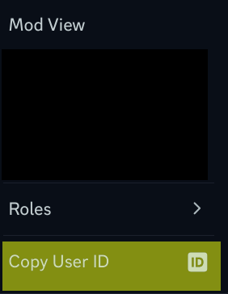

# SCEBot2
Bot for the Systems and Computer Enginering Society (SCESoc) Discord server.

This is the current development version of SCEBot, and will be written in
TypeScript with the latest supported version of discord.js.

With the intent of creating a traditional message command based bot, the commands
are implemented using an Object Oriented design pattern, allowing for a quick
and easy implementation of new commands using existing templates.

A modular system is also being kept in mind as this project develops. Ideally, 
users can fork this repository and need to make little to no tweaks to the source
code in order to run their own version of SCEBot.

Once the original functionality from SCEBot1/blooBot has been ported over to 
SCEBot2, development of commands using Discord's more modern command implementation features
such as slash commands, buttons, forms, etc. can begin. 

## How to set up SCEBot for development

### Dependencies

Discord js is a library that runs in NodeJS. [The discord.js guide](https://discordjs.guide/preparations/#installing-node-js) gives details on how to install NodeJS for your operating system. Installing NodeJS will install the Node Package Manager (npm) along with it.

This project uses yarn for package management. To install yarn run the following command in your terminal:
```
npm install -g yarn
```


Once you have have NodeJS, npm, and yarn installed, clone this repo into your file system and open a terminal in the base directory of the project.


Run the following command:
```
yarn install
```

This will install all the necessary dependencies for this project.

### Environment Variables
SCEBot uses environment variables and will not be able to login without them. Running SCEBot for the first time will generate a .env file with a single key `BOT_TOKEN`. 

This `BOT_TOKEN` key is where you should copy and paste your bot's Discord Application token.

### Config
SCEBot also uses a config file to store a prefix for running commands as well as important role / member ids. You must get these ids manually from a Discord server. This will require that you enable [Developer Mode](https://support-dev.discord.com/hc/en-us/articles/360028717192-Where-can-I-find-my-Application-Team-Server-ID).

You can right click on guild members to copy their user id and you can right click on roles to copy their role id:



The following fields in the config file needs to be filled out:

```json
{
	"prefix":"",
	"elevated_roles": {
        "maintainer": "", // This should be a user id
        "moderator": "",
        "admin": "",
        "exec": "",
        "member": ""
    }
}

```